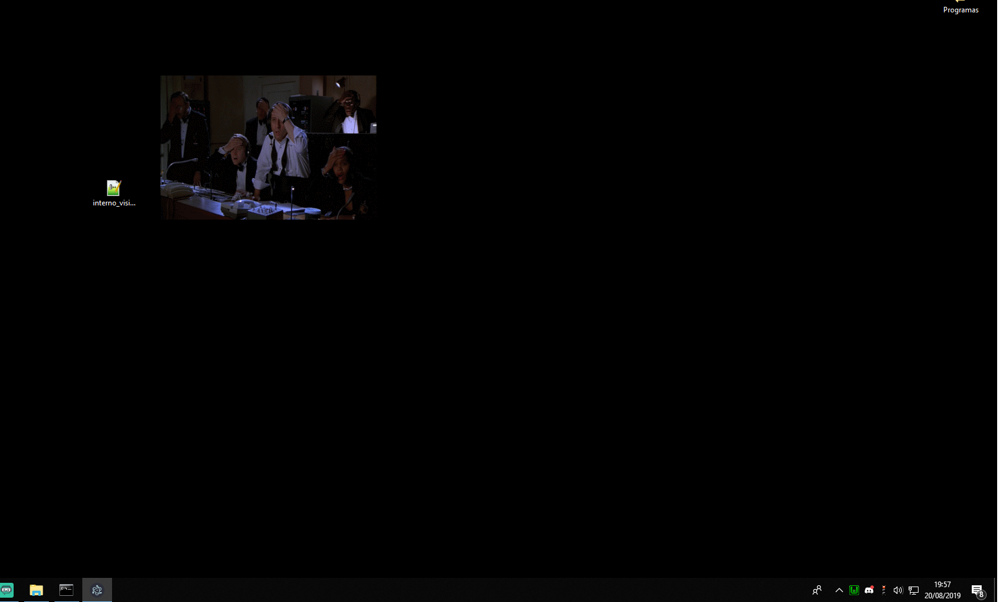

# Twitch Animator (Criando um InstantGif no PC) // Electron

Demo: 
   


TODO:
[ x ] - Exibir o GIF na tela  
[ x ] - Capturar atalhos no Electron - godin_  // Ex: Ctrl + B ->   Alert()  
[ x ] - Midir o tamanho do Gif  
[ x ] - Rodar o serviço em Background  
[ x ] - Deixar Full Screen ou centralizado  
[   ] - Tray Icon  
[   ] - Cadastrar o Gif (Pasta)  
[   ] - Mapear Atalhos  
[   ] - Cadastrar os Atalhos  
[   ] - Vincular 'Atalhos (Ctr + NumPad-1)' X 'Gif AiQueDelicia.gif'  


How To use:  
```shell
git clone https://github.com/electron/electron-quick-start
cd electron-quick-start
npm install
npm start
``` 


